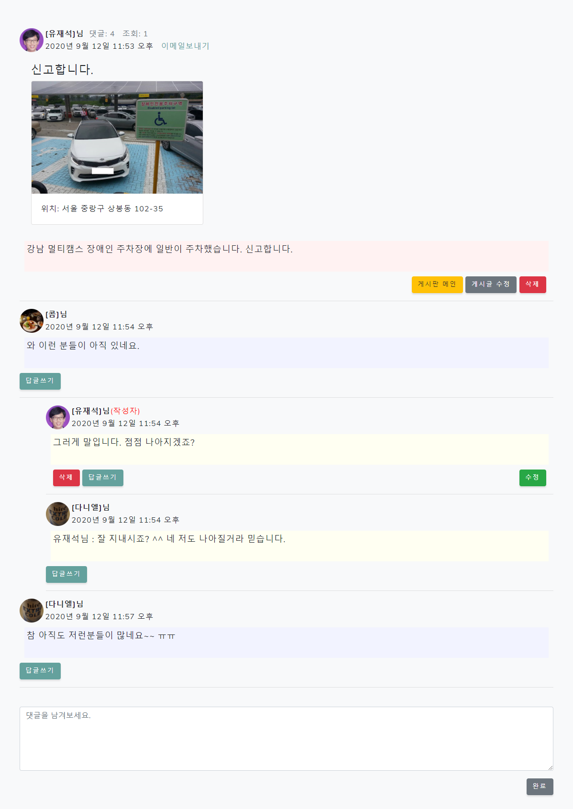

# 장애인을 위한 웹사이트 구축 프로젝트
> 장애인을 위한
>
> Main : 가입 시 등록한 비상연락처 및 문구로 플로팅 베너 노출 긴급 통화및 메세지 전송 기능을 제공 및 해더에 사용자 이미지 노출
>
> 가입 : ajax를 활용하여 keydown 시 닉네임 중복 체크
>
> 장애시설위치 : 현재 위치 주변 장애 시설 위치 및 정보를 leaflet map 상에 표기
>
> 편의시설위치 : 현재 위치 주변 편의 시설 위치 및 정보를 google map 상에 표기
>
> 신고게시판 :  모바일 카메라 사용, GSP위치를 활용하며, 네이버 카페 게시판의 계층구조를 참고하여 구현
>
> 자유게시판 :  네이버 카페 게시판의 계층구조를 참고하여 구현하며 페이지, 검색 기능, 조회 수, 답글 수 노출
>
> Q&A : 단층게시판을 활용하여 관리자 권한만으로 답변 가능
>

### 적용 URL : https://kim672772.pythonanywhere.com/fordisapp/

